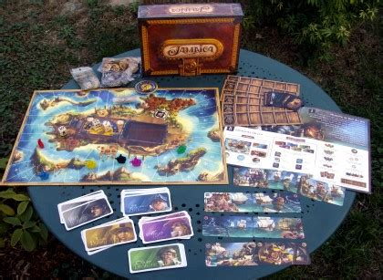

# Rapport - Jamaïca
#### LE POINSEL ROBIN TRIAS

# Table des matières
## 1 Présentation Générale

1.1 Archétype 

1.2 Règles du jeu 
 
1.3 Ressources 

### 1.1 Archétype 
L’objectif de ce projet est la réalisation du jeu Jamaïca, avec des règles adaptées. Un exemple est présenté sur la figure suivante.

.

### 1.2 Règles du jeu
#### 1-Tour de jeu
A) Jet de Dés :
Le capitaine (choisi au hasard au premier tour puis on tourne à chaque tour dans le sens horaires) jette les dés action. Ilchoisit dans quel ordre il les pose sur la boîte de navigation, après avoir consulté les 3 cartes qu'il a en main.
  
B) Chois de Carte :
Une fois les dés placés, chacun choisit secrètement la carte de sa main qu'il veut jouer et la pose face cachée devnat lui.

C) Actions :
Après que tout le monde ait choisi une carte, le capitaine retourne la sienne et effectue les deux actions : d'abord celle du matin puis celle du soir. L'action du matin est liée au dé de gauche et l'action du soir au dé de droite.

D) Fin du tour :
Lorsque tout le monde a joué, on prend la première carte de sa pioche pour comléter sa main à 3 cartes. La dernière carte jouée reste face visible sur la table.

#### 2-Types d'actions
A) Chargement : 
Si l'on est en présence de l'une des 3 îcones chargement(or, nourriture ou canon), on doit charger la ressource indiquée. Le dé lié à l'action indique le nombre de jetons à charger dans une cale vide (on ne peut donc jamais ajouter de jetons à une cale qui en contient déjà). 
-> si l'on ne dispose plus d'aucune cale vide lors d'un chargement, il faut en vider une pour faire de la place (les jetons sont rendus à la Banque) mais on ne peut pas jeter le même type de jetons que ceux que l'on charge.

B) Déplacement :
Si l'on est en présence de l'une des 2 îcones déplacment, on doit reculer ou avancer son bateau. Le déindique le nombre des cases dont on doit se déplacer.

#### 3-Combats
A) Attaque : Quand un joueur arrive sur une case avec un autre joueur il est alors attaquant. Il commence le combat en dépensant un nombre de jeton poudre à canin de son choix (s'il en possède). Il jette ensuite le dé de combat et additionne son résultat au nombre de poudres mises en jeu. Il obitent ainsi sa puissance de feu.

B) Défense : Ensuite, c'est au défenseur d'investir en poudre s'il le désire, de jeter le dé de combat et d'obtenir lui aussi sa puissance de feu.

C) Comparaison : Le joueur qui obtient ainsi la plus grande puissance de feu remporte le combat. En cas d'égalité, il ne se passe rien.

D) Conséquences : Le vainquer d'in combat peut choisir l'une des 3 options suivantes : \
a) voler tout le contenu d'un cale de son adversaire; \
b) voler un trésor de son adversaire; \
c) donner un trésor maudit à son adversaire;

!!!!) Etoile : Un joueur qui obtient l'étoile gagne immédiatement son combat. Si l'attaquant l'obtient son adversaire ne peut pas se défendre. Si c'est le défenseur qui l'obtient alors il gagne quelque soit la puissance de feu de l'attaquant.

#### 4-Prix des cases 
A) Gratuites : Lorqu'un joueur finit son déplacement sur un repaire de pirates, il n'y a jamais rien à payer. 

B)Payantes : a) Sur une case port, le prix indique un nombre de pièce à payer.\
b) Sur un case mer, le prix indique un nombre de nourriture à payer.

#### 5-Pénuries 
A) Payer : En cas de manque pour payer, on donne tout ce que l'on a à la banque quand même si l'on ne peut pas payer.
B) Reculer : Ensuite, on doit reculer jusqu'à la première case dont on peut s'acquitter entièrement du prix (il se peut que cela soit un repaire de pirates, étant donné que c'est une case gratuite).
C) Payer : Pour finir, on paie le prix de la nouvelle case d'arrivée.

#### 6-Trésors
A) Pouvoir : Les 4 cartes trésor ci-dessous procurent un pouvoir spécial. Lorsque l'on en pioche une, on la pose à côté de ses cales face visible et l'on bénéficie de son pouvoir aussi longtemps que l'on est en sa possession. \
a) Carte de Morgan : Permet de jouer avec 4 cartes action en main au lieu de 3; \
b) Sabre de Saran : Permet de relancer son propre dé de combat ou de faire relancer celui de l'adversaire. Le deuxième jet doit être accepté. \
c) Lady Beth : Augmente de 2 points la valeur du dé de combat; \
d) 6e cale : La carte sert de 6e cale, qui suit les règles de chargement habituelles.

B) Richesses : Les 8 cartes trésors ci-dessous affactent le score d'un joueur en fin de partie. Lorsque l'on en pioche une, on la pose à côté de ses cales face cachée. On ne la révélera qu'en toute fin de partie, lors du décompte des points. Il existe 5 cartes trésors de valeur +3 à +7 points. Et 3 trésors de -2 à -4.

#### 7-Fin du jeu 
A) Arrivée : Dès lors qu'un joueur atteint la dernière case il s'y arrête. Son éventuelle action du soir est ignorée. On finit le Tour de Jeu en Cours et la partie est alors terminée. On passe ensuite au décompte des points.

B) Décompte : Le score final d'un joueur est le résultat de l'opération suivante : le nombre indiqué en blance sur la case où se trouve son bâteau + les pièces dans sa cale + éventuels trésors - éventuels trésors maudits. ( Si aucun chiffre n'est marqué sur la case on doit alors enlevé 5 points )

C) Victoire : Le joueur totalisant le score le plus élevée l'emporte. En cas d'égalité c'est le joueur le plus en avant quigagne la course qui gagne. En cas de nouvelle égalité les joueurs se partagent la victoire.

#### Précision de certaines règles :

1- Tour de jeu : 
Lorsque  la pioche est épuisée et que l'on doit reprend une carte en main, on mélange la défausse pour créer une nouvelle pioche. 

2- Types d'actions : Il faut toujours résoudre entièrement son action du matin avant de passer à celle du soir ! Ainsi :
 * si la premeère est un déplacment, on ne peut pas payer le prix de la cas avec des ressources que l'on ne gagnera qu'avec la seconde action;
 * entre deux actions déplacement, on n'échappe ni aux combats, ni aux paiements des cases;
 * les doublons gagnés avec la carte or-or ne peuvent pas être cumulés et chargés dans une cale unique.

3- Combat :
* Il n'y a jamais de combat à Port Royal (l'arrivée);
* Si l'on obtient l'étoile au dé de combat, on ne récupère pas la poudre investie.
* Si un joueur finit son déplacement sur une case où sont déjà plusieurs bâteaux, il choisit un adversaire et il n'y a qu'un seul combat.

4- Prix des cases :
* Lorsque l'on paie le prix d'une case, on se sert librement dans ses cales.
* On ne paie le prix d'une case qu'une seule lors de l'arrivée sur cette case.

5-Pénurie :
* Lorsque l'on recule suite à une Pénurie et que la première case dont on peut s'acquitter du prix est occupée par un adversaire, il y a d'abord un combat.
* Lorsque l'on recule en deçà d'une bifurcation on choisit librement son itinaire ( si il y a des bifurcations ).

6- Trésors : Sabre de Saran :
* il n'est pas possible d'ajouter de la poudre au 2nd lancer;
* on peut aussi faire relanser l'adversaire si il obtient une étoile;
* le pouvoir du Sabre doit être utilisé immédiatement après le lancer que l'on aimerait voir modifié.

* On peut regarder le contenur d'un trésor caché avant de le voler à un adversaire.
* Lorsque l'on vole le trésor 6e cale, on en vole aussi le contenu. 
