# Rapport - Jamaïca
- - - -
#### LE POINSEL ROBIN TRIAS  
- - - -
# Table des matières
- - - -
## 1-Présentation Générale

**1.1 Archétype**

**1.2 Règles du jeu** 
 
**1.3 Ressources**

## 2-Description et conception des états

**2.1 Descriptions des états**

**2.2 Conception logiciel**

## 3-Rendu : Stratégie et Conception 

**3.1 Stratégie de rendu d'un état**

**3.2 Conception logiciel**

## 4-Règles de changement d'états et moteur de jeu 

**4.1 Horloge globale**

**4.2 Changement extérieur**

**4.3 Changement autonome**

**4.4 Conception logiciel**

## 5-Intelligence Artificielle

**5.1 Stratégie**

**5.2 Conception logiciel**

## 6-Modularisation

**6.1 Organisation**

**6.2 Conception logiciel**

- - - -
## 1-Présentation Générale
>### 1.1 Archétype 
>>L’objectif de ce projet est la réalisation du jeu Jamaïca, avec des règles adaptées. Un exemple est présenté sur la figure suivante.  \
>>

>### 1.2 Règles du jeu
>>#### 1-Tour de jeu
>>>**A)** Jet de Dés :
Le capitaine (ce dernier est choisi au hasard au premier tour (par exemple joueur "N") puis on tourne à chaque tour dans le sens horaire : au tour suivant le joueur "N+1" sera le nouveau capitaine du tour) jette les dés d'action. Il choisit dans quel ordre il les pose sur la boîte de navigation, après avoir consulté les 3 cartes qu'il a en main (cela fixe ces valeurs de dés pour ce tour). La valeur du dé de jour indique la quantité de resource que l'on reçoit ou la quantité de mouvement à effectuer sur les cases lors de l'acton du jour (à gauche sur les cartes). Idem pour le dé de nuit (action à droite sur les cartes).
>>**B)** Choix de Carte :
Une fois les dés placés, chacun choisit secrètement la carte (parmi les 3 de sa main) qu'il veut jouer et la pose face cachée devant lui. Ce choix doit être judicieux et effectué en fonction de la valeur des dés de jour/nuit.
>>**C)** Actions :
Après que tout le monde ait choisi une carte, le capitaine retourne la sienne et effectue les deux actions : d'abord celle du matin puis celle du soir. L'action du matin est quantifiée par le dé de gauche et l'action du soir par le dé de droite.  
>>**D)** Fin du tour :
Lorsque tout le monde a joué, on prend la première carte de sa pioche pour compléter sa main à 3 cartes. La dernière carte jouée reste face visible sur la table et en dehors de notre main.
>>#### 2-Types d'actions
>>>**A)** Chargement : 
Si l'on est en présence de l'une des 3 îcones chargement (or, nourriture ou canon), on doit charger la ressource indiquée. Le dé lié à l'action indique le nombre de jetons à charger dans une cale vide (on ne peut donc jamais ajouter de jetons à une cale qui en contient déjà). 
-> si l'on ne dispose plus d'aucune cale vide lors d'un chargement, il faut en vider une pour faire de la place (les jetons sont rendus à la Banque) mais on ne peut pas jeter le même type de jetons que ceux que l'on charge (exemple une cale d'or peut être remplacée que par de la nourriture ou des canons et vice-versa).  
>>**B)** Déplacement :
Si l'on est en présence de l'une des 2 îcones déplacement, on doit reculer ou avancer son bateau. Le dé indique le nombre de cases dont on doit se déplacer.  
>>#### 3-Combats
>>>**A)** Attaque : Quand un joueur arrive sur une case avec un autre joueur il est alors attaquant. Il commence le combat en dépensant le nombre de jeton poudre à canon de son choix (s'il en possède). Il jette ensuite le dé de combat et additionne son résultat au nombre de poudre mis en jeu. Il obtient ainsi sa puissance de feu.
>>>**B)** Défense : Ensuite, c'est au défenseur d'investir en poudre s'il le désire, de jeter le dé de combat et d'obtenir lui aussi sa puissance de feu.  
>>>**C)** Comparaison : Le joueur qui obtient la plus grande puissance de feu remporte le combat. En cas d'égalité, il ne se passe rien.  
>>>**D)** Conséquences : Le vainquer d'un combat peut choisir l'une des 3 options suivantes : 
>>>>**a)** voler tout le contenu d'une cale de son adversaire; \
**b)** voler un trésor de son adversaire; \
**c)** donner un trésor maudit à son adversaire;  
>>> 
>>>**N.B.)** Etoile : Un joueur qui obtient l'étoile gagne immédiatement son combat. Si l'attaquant l'obtient son adversaire ne peut pas se défendre. Si c'est le défenseur qui l'obtient alors il gagne quelque soit la puissance de feu de l'attaquant.
>>#### 4-Prix des cases 
>>>**A)** Gratuites : Lorqu'un joueur finit son déplacement sur un repaire de pirates, il n'y a jamais rien à payer.  
>>>**B)** Payantes : 
>>>>**a)** Sur une case port, le prix indique un nombre de pièce à payer.\
**b)** Sur un case mer, le prix indique un nombre de nourriture à payer.
>>#### 5-Pénuries 
>>>A) Payer : En cas de manque pour payer, on donne tout ce que l'on a à la banque quand même si l'on ne peut pas payer. Remarque : un combat est prioritaire sur une pénurie.
B) Reculer : Ensuite, on doit reculer jusqu'à la première case dont on peut s'acquitter entièrement du prix (il se peut que cela soit un repaire de pirates, étant donné que c'est une case gratuite).  
C) Payer : Pour finir, on paie le prix de la nouvelle case d'arrivée.
>>#### 6-Trésors
>>>**A)** Pouvoir : Les 4 cartes trésor ci-dessous procurent un pouvoir spécial. Lorsque l'on en pioche une, on la pose à côté de ses cales face visible et l'on bénéficie de son pouvoir aussi longtemps que l'on est en sa possession. \
>>>>**a)** Carte de Morgan : Permet de jouer avec 4 cartes action en main au lieu de 3; \
**b)** Sabre de Saran : Permet de relancer son propre dé de combat ou de faire relancer celui de l'adversaire. Le deuxième jet doit être accepté. \
**c)** Lady Beth : Augmente de 2 points la valeur du dé de combat; \
**d)** 6e cale : La carte sert de 6e cale, qui suit les règles de chargement habituelles.  
>>> 
>>>**B)** Richesses : Les 8 cartes trésors ci-dessous affectent le score d'un joueur en fin de partie. Lorsque l'on en pioche une, on la pose à côté de ses cales face cachée. On ne la révélera qu'en toute fin de partie, lors du décompte des points. Il existe 5 cartes trésors de valeur +3 à +7 points. Et 3 trésors de -2 à -4.
>>#### 7-Fin du jeu 
>>>**A)** Arrivée : Dès lors qu'un joueur atteint la dernière case il s'y arrête. Son éventuelle action du soir est ignorée. Les joueurs finissent le Tour de Jeu en Cours et la partie est alors terminée. On passe ensuite au décompte des points.  
**B)** Décompte : Le score final d'un joueur est le résultat de l'opération suivante : le nombre indiqué en blanc sur la case où se trouve son bateau (nombre pouvant être >0 ou <0 ou =0 : il traduit l'avancement du joueur) + les pièces dans sa cale + éventuels trésors - éventuels trésors maudits. ( Si aucun chiffre n'est marqué sur la case on doit alors enlever 5 points )  
**C)** Victoire : Le joueur totalisant le score le plus élevé l'emporte. En cas d'égalité c'est le joueur le plus en avant qui gagne la course. En cas de nouvelle égalité les joueurs se partagent la victoire.

>#### Précision de certaines règles :
>>**1-** Tour de jeu : 
Lorsque la pioche est épuisée et que l'on doit reprendre une carte en main, on mélange la défausse pour créer une nouvelle pioche.  
**2-** Types d'actions : Il faut toujours résoudre entièrement son action du matin avant de passer à celle du soir ! Ainsi :
 >>>* si la première est un déplacment, on ne peut pas payer le prix de la case avec des ressources que l'on ne gagnera qu'avec la seconde action;
 >>>* entre deux actions déplacement, on n'échappe ni aux combats, ni aux paiements des cases;
 >>>* les doublons gagnés avec la carte or-or ne peuvent pas être cumulés et chargés dans une cale unique.  
 >>
>>**3-** Combat :
>>>* Il n'y a jamais de combat à Port Royal (l'arrivée);
>>>* Si l'on obtient l'étoile au dé de combat, on ne récupère pas la poudre investie.
>>>* Si un joueur finit son déplacement sur une case où sont déjà plusieurs bâteaux, il choisit un adversaire et il n'y a qu'un seul combat.
>>
>>**4-** Prix des cases :
>>>* Lorsque l'on paie le prix d'une case, on se sert librement dans ses cales.
>>>* On ne paie le prix d'une case qu'une seule lors de l'arrivée sur cette case.
>>
>>**5-** Pénurie :
>>>* Lorsque l'on recule suite à une Pénurie et que la première case dont on peut s'acquitter du prix est occupée par un adversaire, il y a d'abord un combat.
>>>* Lorsque l'on recule en deçà d'une bifurcation on choisit librement son itinaire ( si il y a des bifurcations ).
>>
>>**6-** Trésors : Sabre de Saran :
>>>* il n'est pas possible d'ajouter de la poudre au 2nd lancer;
>>>* on peut aussi faire relanser l'adversaire si il obtient une étoile;
>>>* le pouvoir du Sabre doit être utilisé immédiatement après le lancer que l'on aimerait voir modifié.
>>* On peut regarder le contenur d'un trésor caché avant de le voler à un adversaire.
>>* Lorsque l'on vole le trésor 6e cale, on en vole aussi le contenu. 

>### 1.3 Ressources
>Les ressources que nous avons pour ce jeu est le jeu physique en lui-même. 
> Nous avons essayé de trouver des sprites libre de droit sur internet.
> Et nous avons réalisé certains sprites à la main. Voici les sprites réalisés à la main :
> 
>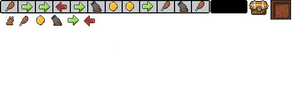
> Le reste des images viennent soit d'IA soit de sprites libres de droit trouvés sur internet.
## 2-Description et conception des états

>### 2.1 Descriptions des états
>Un état du jeu est formé par un ensemble d'éléments fixes (la map) et un ensemble d'éléments mobiles (les bateaux). Les éléments possèdent les propriétés suivantes :
>>* Position sur la map et un identifiant pour les éléments moblies 
>>* Des ressources (nourriture ou gold) pour chaque case de la map 
>
>#### 1-Eléments fixes
>La map est formée par un tableau d'éléments qui sont les cases. La taille de ce tableau est fixée au début de la partie. Les types de cases sont :  
>>  **Cases Or** :
> Les cases coûtant de l'or à chaque bâteau passant dessus.  
>> **Cases Nourriture** :
> Les cases coûtant de la nourriture à chaque bâteau passant dessus.  
>> **Cases libres/trésors** : 
> Ces cases possèdent un trésor mais une fois le trésor récupéré elles sont gratuites pour tous les joueurs.
>
>#### 2-Eléments mobiles
> Il s'agit du bâteau se déplaçant sur les cases, représenté par Player dans le state.dia, il possède les attributs de la photo suivante :
>>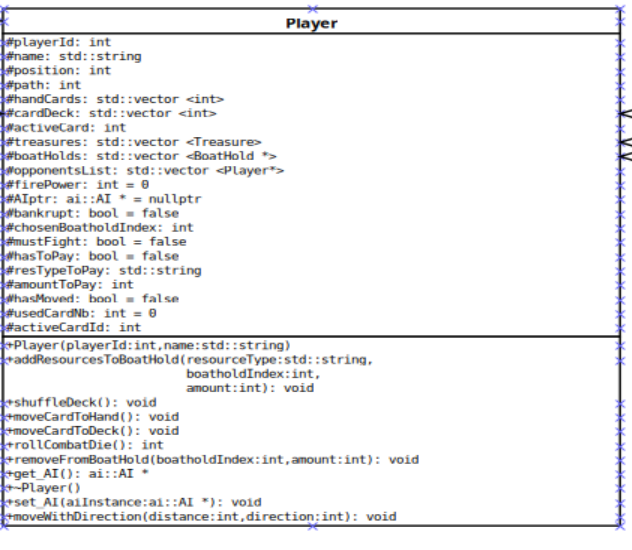
> On voit que pour la localisation sur la map nous avons un int position. Celui-ci détermine la position du player dans le tableau de la map.
> Chaque Player à un playerID et un Name qui servent à identifier un player.
> Il possède aussi tous les éléments qui nous permettent de vérifier chaque règle et effectuer les actions voulues.

>### 2.2 Conception logiciel
>>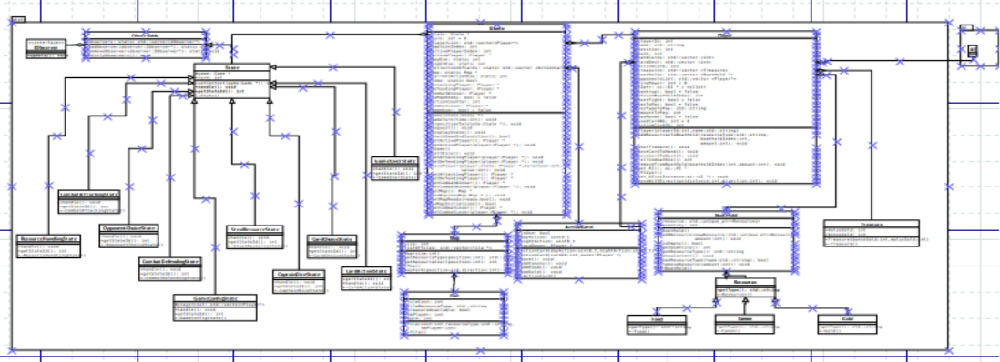
>Ceci est une version du state.dia dans sa globalité, nous allons par la suite détailler les états des parties importantes et visibles pour le joueur.
> 
> **Classe Player** : comme vu ci-dessus player la classe player possède un getter de sa position. De plus la classe possède toutes les caractéristiques pour 
> savoir l'état dans lequel un player est à un moment donné donc : sa position, ce qu'il a dans ses cales, le choix des cartes, le choix de la position des dés, l'ajout de ressources dans sa cale...
> Il possède aussi des attributs pour vérifier certaines règles comme le fait qu'il n'est pas de quoi payer une case par exemple.
> 
> 
> **Classe Game** : la classe game (voir en dessous) permet de passer d'un état à un autre en passant par la classe state et la méthode transitionTo.
> Dans cette classe, on retient qui a été le capitaine du tour en cours, on regarde les modifcations apportées à la map par les commandes de l'engine.
>
> 
> - [https://refactoring.guru/design-patterns/state](./https://refactoring.guru/design-patterns/state)  
>
> Ce design pattern nous permet de passer d'un état à un autre comme on le souhaite.
> 
> **Classe State** : 
> 
>
> 
>> La classe State permet donc de passer d'un état à l'autre entre tous les états ci-dessus, la transition se fait à la fin de la request appelée depuis le client.
>>
>> On voit qu'il y a handle1() et handle2(), qui sont les méthodes utilisées pour le design-pattern State, dans chacune des classes pour pouvoir faire la transition entre chaque état.
> 
> **Classes ActionCard, Treasure, BoatHold** : 
> 
>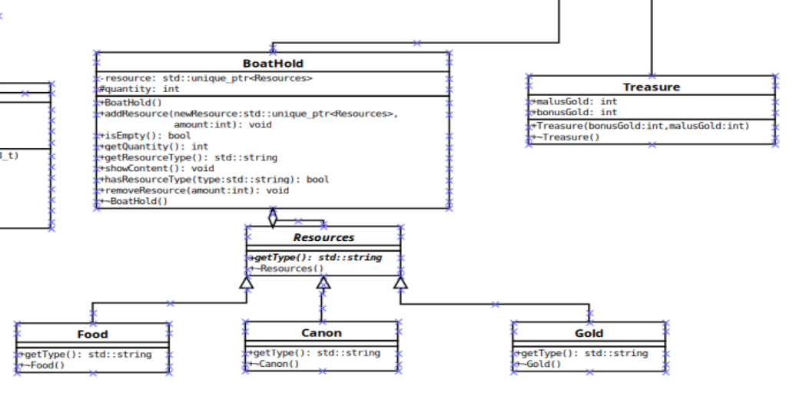

>> - **Treasure** : pour l'instant un trésor n'est qu'un bonus ou malus de gold, il ne s'agit donc que d'entier à ajouter ou enlever dans le décompte final de gold.
>> - **BoatHold** : c'est une cale, donc on regarde si on doit ajouter ou non une ressource, si une cale d'un player est vide ou non... il s'agit principalement de getter des ressources de chaque boathold. 
>>
>> Pour avoir le type de ressource à prendre il y a la classe resources :
>> 
>> - **Resources** : cette classe donne le type de ressource à attribuer au BoatHold.
>
> 
>**Classe Map** :
>
>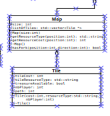
> 
>> La map est une liste de vecteur de type Tile qui sont représentés par ce qu'elle coûte, le nombre de players dessus ainsi que le nombre de trésors dessus. Le path n'est pas encore utilisé.
> 
## 3-Rendu : Stratégie et Conception 

>### 3.1 Stratégie de rendu d'un état**
>>La classe StateLayer est un Observer des classes State dans state https://refactoring.guru/design-patterns/observer/cpp/example#lang-features. A chaque changement d'état de State, les observateurs sont notifiés. On peut donc suivre l'état du jeu dans render qui a lui même sa machine à état qui celle de state (nous avons utilisé un switch/case au lieu du design pattern State car manque de temps et plus simple à mettre en place).
Pour le rendu, on utilise la librairie SFML. On utilise une fenêtre SFML (sf::RenderWindow) pour afficher une fenêtre ou apparaitra le rendu du jeu. 
On utilise nos propres images qu'on associe à des textures SFML (sf::Texture). On peut ensuite crée un ou plusieurs sprites (sf::Sprite) liés à une texture pour ensuite les afficher sur la fenêtre SFML grâce à la fonction draw() de sf::RenderWindow. Il y a aussi la possibilité d'afficher des textes (sf::Text) avec la police désirée (sf::Font).  
>### 3.2 Conception logiciel**
>>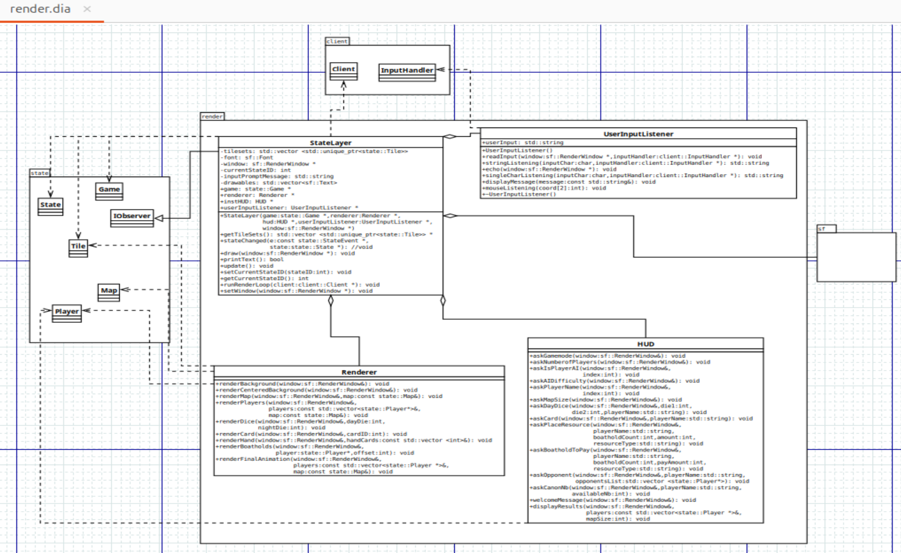
>>StateLayer gère la machine à état, Renderer affiche tous les sprites et HUD affiche le texte pour indiquer les actions aux joueurs. 

 ## 4-Règles de changement d'états et moteur de jeu 

> ### 4.1 Horloge globale
>>Les changements d'état sont faits à la chaîne sans horloge. Nous allons mettre des délais pour laisser le temps aux joueurs
>>de comprendre l'affichage qui change. Les changements d'états sur la console se font après confirmation avec un "y" donc on attend l'accord
>> du joueur physique ou IA pour continuer à jouer.
> ### 4.2 Changements extérieurs
>>Les changements extérieurs sont provoqués par des commandes extérieures, comme la pression sur un
>>bouton ou un ordre provenant du réseau quand le réseau sera effectué :
>>>Commandes : dans la classe engine elles sont appelées dans le client avec les paramètres adaptés en arguments.
> ### 4.3 Changements autonomes
>>Les changements autonomes sont appliqués à chaque création ou mise à jour d’un état, après les changements extérieurs. Ils sont exécutés dans l’ordre suivant :
>>>0) On commence par créer l'environnement de jeu donc la map, les joueurs, les cartes... On ne repasse normalement pas dans cet état par la suite.
>>>1) A chaque tour, on choisit un capitaine qui est supposé être la personne après le capitaine précédent. On lui demande alors de lancer et choisir les dés jour/nuit qu'il veut.
>>>2) On demande à chaque joueur de choisir la carte qu'il veut parmi les cartes qu'il a en main.
>>>3) On regarde l'action de la carte jour puis nuit. Et soit on à un mouvement et on l'exécute soit on passe à RessourceHandlingState.
>>>4) On affecte les ressources de la carte dans la cale que choisi le joueur.
>>>5) Si après un mouvement on tombe sur une case avec des joueurs on choisit contre lequel on veut combattre.
>>>6) L'attaquant va dans ce state pour lancer les dés et choisir les canons pour le combat 
>>>7) Le défenseur fait de même que l'attaquant.
>>>8) Après un combat le gagnant choisi les ressources à voler au perdant.
>>>9) Quand un joueur atteint la dernière case, on finit le tour puis on fait le décompte des points et on affiche l'or de chaque joueur.
> 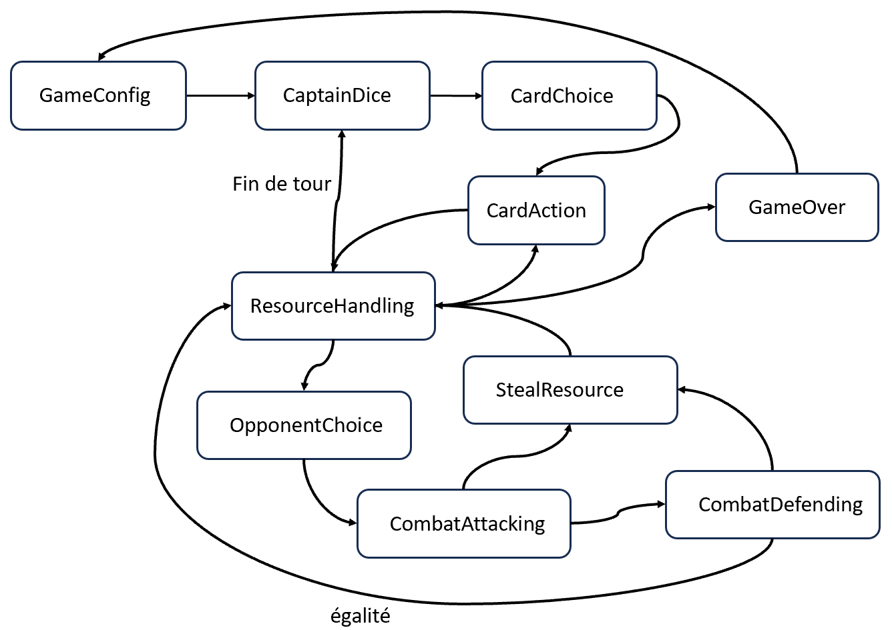

>### 4.4 Conception logiciel
>>Le diagramme des classes pour le moteur du jeu est présenté ci-dessous. L’ensemble du moteur de jeu
>>repose sur un patron de conception de type Command, et a pour but la mise en œuvre différée de commandes
>>extérieures sur l’état du jeu.
> 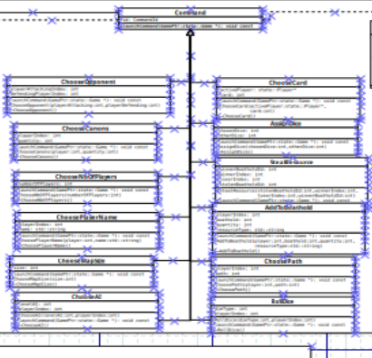
>>>**Classes Command :** Le rôle de ces classes est de représenter une commande, quelque soit sa source. Notons bien que ces classes ne gère absolument pas l’origine des com-
mandes, ce sont d’autres éléments en dehors du moteur de jeu qui fabriquerons les instances de ces classes.
>>>* AssignDice : demande le dé à mettre sur jour au joueur.
>>>* AddToBoathold : ajoute une ressource à un boathold.
>>>* ChooseAI : choisi quelle IA va jouer.
>>>* ChooseCards : demande au joueur la carte qu'il veut jouer.
>>>* ChooseCanons : demande au joueur le nombre de canons qu'il veut jouer.
>>>* ChooseMapSize : demande aux joueurs la taille de la carte.
>>>* ChooseNbOfPlayer : demande le nombre de joueurs.
>>>* ChoosePath : ne fait rien pour l'instant.
>>>* ChoosePlayerName : permet aux joueurs de choisir leur pseudo.
>>>* RollDice : génère deux dés de façon "random".
>>>* StealResources : permet de voler des ressources après un combat.
>>> 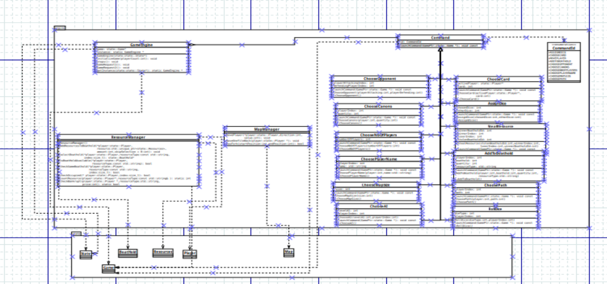
>>> L'engine est ce qui va dire au state de changer : il reçoit les informations du client et donne la commande à suivre pour qu'il y ait un changement d'état. 

## 5-Intelligence Artificiel
>### 5.1 Stratégie
>> #### 5.1.1 IA Random
>> L'IA Random renvoie à chaque input une valeur aléatoire qui dépend
>> de l'action à faire.
>>>Par exemple : elle renvoie un entier entre 1 et 3 quand il faut choisir une carte 
>> et un entier entre 1 et 6 quand il faut choisir un boathold.
> 
>> #### 5.1.2 IA Heuristic
>> Cette IA agit comme le ferait un humain, mais avec une stratégie prédéfinie pour chaque action :
>> * le choix de l'emplacement à utiliser quand on obtient une ressource : si un emplacement est libre, l'IA le prend sinon
>> elle regarde s'il y a des canons et les remplacent. Dans le cas où il n'y a pas de canons, on regarde la quantité de chaque ressource(s) restante(s) et on remplace la plus faible si c'est possible. 
>> * le choix des cartes : l'objectif est de choisir les cartes qui ne possède pas de canon.
>> * le choix des dés : on regarde ses cartes en main et on met le dé avec la valuer la plus élevée en fonction des cartes que l'on a :
>> 
>>> si l'IA a une carte avec "avancer à gauche", le dé avec la valeur la plus élevée ira à gauche donc le jour. Si la carte a l'action "avancer à droite", l'IA met le dé avec la plus grande valuer la nuit. Pour le reste s'agissant de ressources tout est correct.
>> * le choix du nombre de canons pour un combat : nous avons décidé qu'une stratégie envisageable est de prendre tous les canons dès qu'on le peut.
>> * le choix de l'adversaire quand il y a combat : l'IA Heuristic va compter le nombre de canons de chaques adversaires et le voir s'il y a des cales avec plus de 2 ressources autres que canon et attribuer 
>> un score en fonction de la réponse : -0.5 par canons et +1 par cales avec plus de deux ressources. Le joueur ayant le score le plus élevé sera choisi pour le combat.
> ### 5.2 Conception logiciel
>> Chacune des IA fonctionne avec les mêmes fonctions qui diffèrent en complexité en fonction du niveau demandé.
>> Voici le dia avec les fonctions de chaque IA :
>> 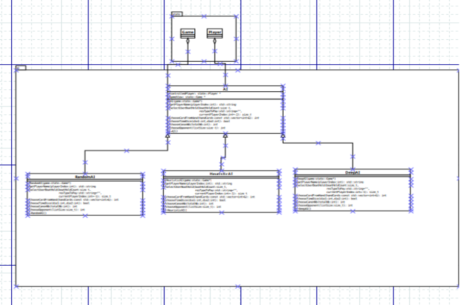
> 
> ## 6-Modularisation
> 
>> ### 6.1 Organisation
> 
>> Pour la partie serveur nous n'avons pas vraiment eu le temps de nous pencher dessus. Néanmoins, nous avons réussi a connecter deux
>> clients au même serveur, de deux ordinateurs différents et afficher la map.
>> 
>>Le but est que quand le premier joueur décide de faire sa partie en ligne en entrant l'input 2 après la première requête nous lançions le jeu pour chaque client. 
>> Malheureusement quand nous effectuons la commande 2 (runGameOnline) le serveur affiche à l'infini la même ligne qui demande un input sans que nous puissions avoir le temps de lui répondre.
>> 
>> ## 6.2 Conception logiciel 
>> Voici donc le dia du server, il est accompagné d'un main et d'un autre clientNetwork qui a la même fonctionnalité que le runGameOnline du client de src. 
>> Il permet de se connecter à un serveur et de faire quelques actions.
>> 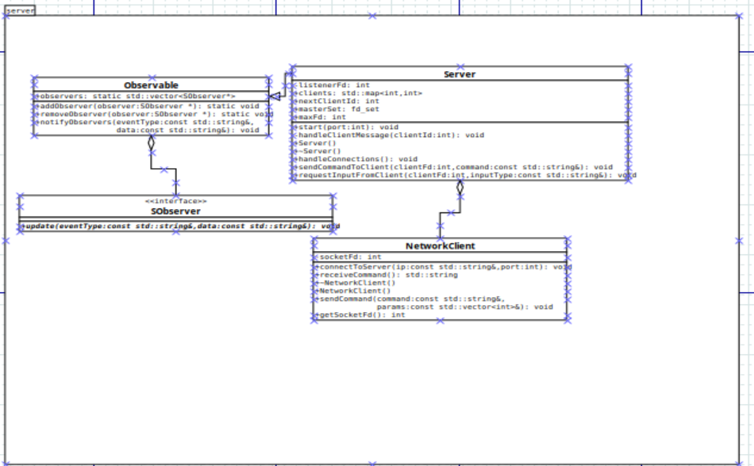
>>
> 
>> La plupart des fonctions qui servent à modifier le jeu et donc les inputs sont dans le client de src qui est le suivant :
>> 
>> Toutes les commandes sont envoyées depuis le client et appellent donc l'engine pour modifier le state.